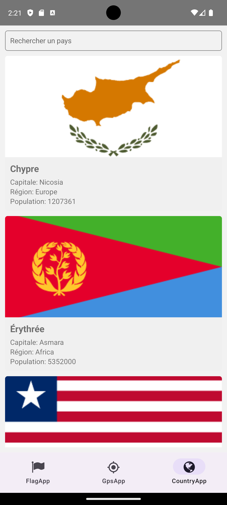
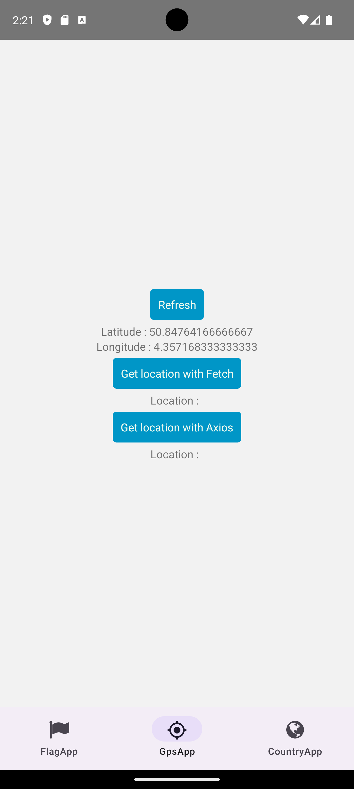

## Capture d'écran de l'Application

  

*Capture d'écran de la page d'accueil de l'application, montrant une sélection de recettes par catégorie.*

*Capture d'écran de la page de détails d'une recette, affichant une image attrayante de la recette, la liste des ingrédients et les instructions de préparation.*

*Capture d'écran de la fonction de filtrage des recettes, permettant aux utilisateurs de sélectionner des filtres spécifiques pour affiner leurs résultats de recherche.*